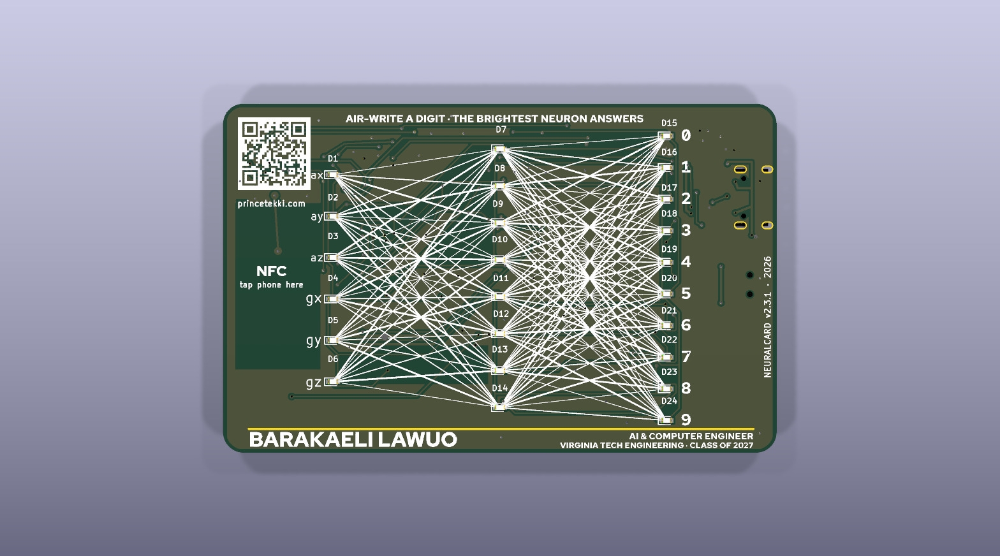
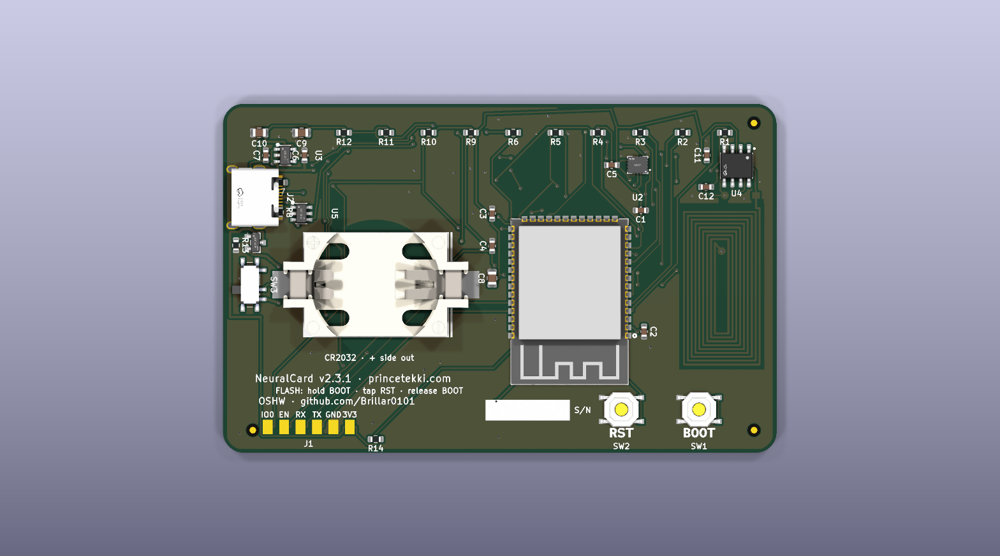
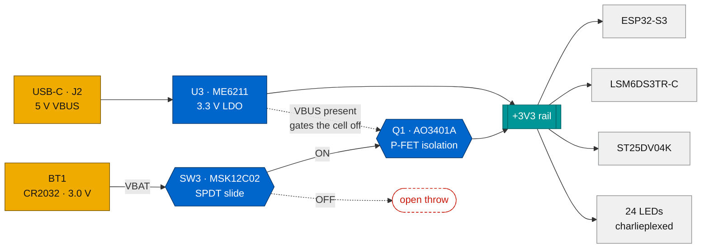
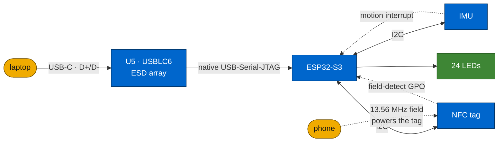
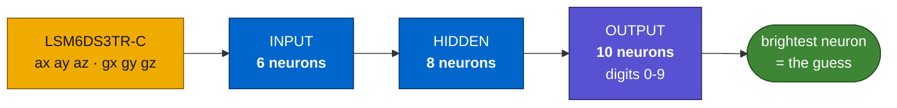

# NeuralCard

[](https://www.kicad.org/)
[](docs/DESIGN.md)
[](docs/drc/README.md)
[](fab/BOM_JLCPCB.csv)
[](CHANGELOG.md)

A business card that runs a neural network.

It is a credit-card-sized PCB, 85.6 by 54 mm, carrying an ESP32-S3, a 6-axis
IMU, and 24 LEDs laid out as the network it actually runs: 6 input neurons,
8 hidden, 10 output. You hold the card, draw a digit in the air, and the LEDs
light with the real activations as inference runs. Brightest output neuron
wins.

The front artwork is the network diagram. The synapse lines are drawn at three
stroke weights, the way a trained model's weights differ. There is also an NFC
tag with a coil antenna etched into the copper, so tapping a phone opens
[princetekki.com/card](https://www.princetekki.com/card) and offers a vCard.
That works with a dead battery, or no battery at all, because the phone's own
field powers the tag.




## Repository layout

| Path | What's in it |
|---|---|
| `hardware/` | KiCad 10 project: schematic, board, custom symbol and footprint libraries, 3D models |
| `fab/` | Manufacturing outputs: gerber zip, drill files, BOM with LCSC part numbers, pick-and-place |
| `firmware/` | ESP-IDF project. Charlieplex driver, IMU driver, gesture recorder. Builds today. |
| `docs/` | Design rationale, datasheet findings, DRC history, audits, FAQ |
| `render/` | The board renders used above |
| `CHANGELOG.md` | Revision history, newest first |

Start with [`docs/DESIGN.md`](docs/DESIGN.md) for why the board is shaped the
way it is, [`docs/FAQ.md`](docs/FAQ.md) for the questions people actually ask,
and [`docs/drc/README.md`](docs/drc/README.md) for the verification trail.

## Hardware

An ESP32-S3-WROOM-1-N8R2 does the thinking and runs the inference. An
LSM6DS3TR-C accelerometer and gyro sits on I2C, and its six axes map one to one
onto the six input neurons. The 24 red LEDs are charlieplexed across 6 GPIO
with software PWM for the glow.

For the business-card half there is an ST25DV04K dynamic NFC tag with a 9-turn
coil in the copper, tuned by a single external cap (C12) against the chip's
internal capacitance.

USB-C arrived in v2.3. The S3 has native USB, so a plain cable flashes the
board and gives a serial console without an adapter. A USBLC6-2SC6 protects the
data pair.

Power comes from either a CR2032 through a real slide switch (SW3) or USB 5 V
through an ME6211 LDO. A P-FET (Q1) disconnects the cell whenever USB is
present, so the board can never try to charge a cell that is not rechargeable.

Two layers, ground poured on both sides and stitched. Every net is one
connected cluster.

## How it's wired

Power first. Two sources that can never fight each other.



Then data. USB-C carries both power and programming. NFC is independent of
both and needs no power of its own.



And inference. The six IMU axes feed the six input neurons, and the LEDs at
each node light with the real activations as the network runs.



All 24 LEDs run from 6 GPIO by charlieplexing. That is why there are 6
current-limiting resistors rather than 24, and why the display works on a coin
cell at all: only one LED is ever actually lit.

## Firmware

`firmware/` is an ESP-IDF project that builds today. It has the charlieplex
driver, with the LED-to-pin mapping extracted from the board netlist rather
than guessed, the LSM6DS3 driver, and a motion-triggered gesture recorder that
prints labelled CSV over the USB-C console. That recorder is how you build a
training set.

```
cd firmware && idf.py set-target esp32s3 && idf.py build && idf.py flash monitor
```

The neural network itself is deliberately not in the repo yet: it has to be
trained on gestures recorded from real hands, which needs assembled boards.
See [`firmware/README.md`](firmware/README.md).

## Ordering

Everything a fab needs is in `fab/`: `NeuralCard_JLCPCB.zip` (gerbers +
drill), `BOM_JLCPCB.csv` (LCSC part numbers), `NeuralCard-cpl.csv`
(placements).

Build spec: 2 layers, 1.6 mm thickness, green soldermask, HASL. That is the
cheap prototype configuration, currently about $2 for five boards.

Two finish options are worth knowing about if you ever make a batch to hand
out. At 0.8 mm the board feels like a card instead of a circuit board. With
ENIG, the hairline under the name comes out gold, since it is a mask opening
over the ground pour and plates with whatever finish you pick. Both cost more.
Neither changes the gerbers, so they are order-time choices.

**Two build routes:**

Hand assembly means ordering bare boards plus a solder-paste stencil and
buying parts from LCSC. It is the cheapest route, and the stencil is what makes
the LGA-14 IMU tractable with hot air.

Factory assembly means JLCPCB Standard PCBA on both sides. It adds roughly $100
of fixed setup and feeder cost, so it only pays off around 30 boards or more.

Two BOM notes. C12, the NFC tuning cap, ships as 68 pF and should be retuned
against the coil once it exists. Read range is the practical test. The NFC chip
is specified as ST25DV04K-IER6S3, a substitute for the original KC variant that
is nearly out of stock everywhere. Same package, same pinout, same function.

## Status

The hardware is done and verified at v2.3.1: DRC reports 0 violations and 0
unconnected, ERC is clean, every net is a single connected cluster, and the
footprints have been checked against manufacturer datasheets. It has never been
fabricated. These files would produce the first physical boards.

The firmware scaffold builds. Drivers and gesture capture work. The trained
model is the remaining piece, and it needs assembled boards before it can
exist.

So today the card is a very elaborate NFC business card, and that part works
the moment the tag is programmed.

## License

CERN-OHL-P v2. See [LICENSE](LICENSE). Do whatever you want with it,
attribution appreciated.
